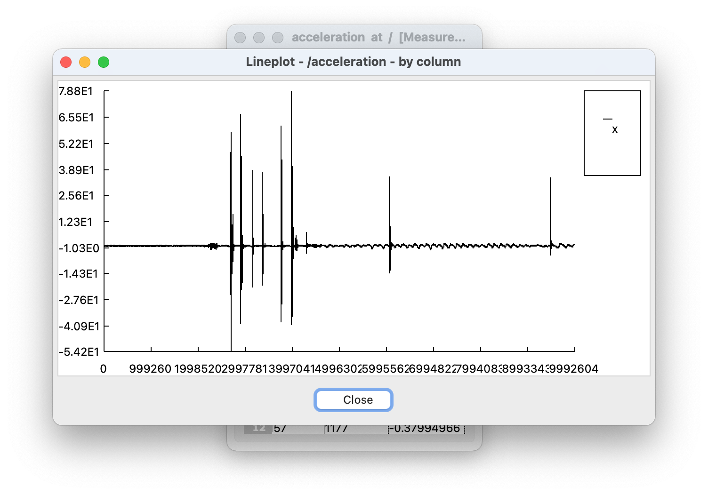

# ICOc

The ICOc software is a collection of tools and scripts for the [ICOtronic system](https://www.mytoolit.com/ICOtronic/). Currently the main purpose of the software is

- **data collection** (via the script `icoc`) and
- **testing** the functionality of the Sensory Holder Assembly (SHA) and Sensory Tool Holder (STH).

For these purposes the software reads data from the Stationary Transceiver Unit (STU) via CAN using the MyTooliT protocol. The STU itself reads from and writes data to the SHA/STH via Bluetooth.

The framework currently requires

- [Microsoft Windows 10](https://microsoft.com/windows), and
- [Python 3](#readme:section:python).

**Notes**:

- In theory you can also use ICOc in Windows 11. However, we did not test the software on this operating system.
- Parts of the test suite also works on Linux. The ICOc measurement software does [**not**](https://github.com/MyTooliT/ICOc/issues/4).

For more information about other required software components, please read the subsection [“Software”](#section:software) in this document.

## Documentation

While you should be able to read the various Markdown files of the documentation (this file and the files in the directory `Documentation`) separately, we recommend you read the [bookdown](https://bookdown.org) manual instead. We provide a prebuilt version of the documentation [here](https://github.com/MyTooliT/ICOc/actions/workflows/documentation.yaml) (just select the latest run and click on the link “ICOc Manual”) or in the [Bitrix24 drive of MyToolit](https://mytoolit.bitrix24.de/docs/path/Documentation Repositories/ICOc/).

### Build

If you want to build the documentation yourself, you need the following software:

- [R](https://www.r-project.org),
- [bookdown](https://bookdown.org),
- [make](<https://en.wikipedia.org/wiki/Make_(software)>), and
- (optionally for the PDF version of the manual) the [TinyTeX R package](https://yihui.org/tinytex/).

After you installed the required software you can build the

- HTML (`make html`),
- EPUB (`make epub`), and
- PDF (`make pdf`)

version of the documentation. The output will be stored in the folder `Bookdown` in the root of the repository. If you want to build all versions of the documentation, just use the command

```
make
```

in the repo root.

## Requirements

### Hardware

In order to use ICOc you need at least:

- a [PCAN adapter](https://www.peak-system.com):

  

  including:

  - power injector, and
  - power supply unit (for the power injector):

    

- a [Stationary Transceiver Unit](https://www.mytoolit.com/ICOtronic/)

   

- a Sensory Holder Assembly or [Sensory Tool Holder](https://www.mytoolit.com/ICOtronic/)

  

   

#### Setup

1. Connect the power injector
   1. to the PCAN adapter, and
   2. the power supply unit.
2. Connect the USB connector of the PCAN adapter to your computer.
3. Make sure that your SHA/STH is connected to a power source. For an STH this usually means that you should check that the battery is (fully) charged.

<a name="section:software"></a>

### Software

<a name="readme:section:python"></a>

#### Python

ICOc requires at least Python `3.7`. The software also supports Python `3.8`, `3.9` and `3.10`. You can download Python [here](https://www.python.org/downloads). When you install the software, please do not forget to enable the checkbox **“Add Python to PATH”** in the setup window of the installer.

<a name="readme:section:pytables"></a>

##### PyTables

ICOc uses the [PyTables][] Python package. Unfortunately the Python package index does not offer Windows binaries for the latest versions of Python in the moment. This means installing PyTables (and therefore ICOc) in Windows without a C compiler and the [HDF5 library](https://www.hdfgroup.org/downloads/hdf5/) library will fail. Since compiling the C extension of the package is not trivial we **recommend downloading a prebuilt binary package** [here](http://www.lfd.uci.edu/~gohlke/pythonlibs/#pytables). Just store the proper file for **your OS and Python version** in your **Downloads folder**.

**Example:** For a 64 bit version of Python `3.10` and PyTables `3.6.1` download the file `tables-3.6.1-cp310-cp310-win_amd64.whl` and afterwards execute the following command in a PowerShell session:

```pwsh
pip install $HOME\Downloads\tables-3.6.1-cp310-cp310-win_amd64.whl
```

We also offer **the same binaries** for all supported 64 bit Python versions in the [**branch binaries**](https://github.com/mytoolit/ICOc/tree/binaries) of the repository. For example, to **install [PyTables][] on Python 3.10** you can use the following commands in a PowerShell session:

```sh
cd "$HOME/Downloads"
git clone -b binaries https://github.com/MyTooliT/ICOc.git
cd ICOc
pip install tables-3.6.1-cp310-cp310-win_amd64.whl
cd ..
Remove-Item -Recurse -Force ICOc
```

[pytables]: http://www.pytables.org

#### PCAN Driver

To communicate with the STU you need to install the driver for the PCAN adapter. You can find the download link for Windows [here](https://www.peak-system.com/quick/DrvSetup). Please make sure that you include the “PCAN-Basic API” when you install the driver.

#### Simplicity Studio (Optional)

For the tests that require a firmware flash you need to install [Simplicity Studio](https://www.silabs.com/products/development-tools/software/simplicity-studio). Please also make sure to install the Simplicity Commander tool inside Simplicity Studio. Please note, that you do not need to install this software if you just want to measure data with ICOc.

<a name="readme:section:install"></a>

## Install

Please clone [this repository](https://github.com/MyTooliT/ICOc) to a directory of your choice. You can either use the [command line tool `git`](https://git-scm.com/downloads):

```sh
git clone https://github.com/MyTooliT/ICOc.git
```

or one of the many available [graphical user interfaces for Git](https://git-scm.com/downloads/guis) to do that.

The repository contains everything necessary to communicate with an STU over CAN to retrieve data from an STH.

Before you use the software you need to install it (in developer mode). To do that please run the following command in the root of the repository:

```sh
pip install -e .
```

Afterwards you can use the various [scripts](#scripts:section:scripts) included in the package.

### Troubleshooting

#### Insufficient Rights

**If you do not have sufficient rights** to install the package you can also try to install the package in the user folder:

```sh
pip install --user -e .
```

#### Unknown Command `icoc`

If `pip install` prints **warnings about the path** that look like this:

> The script … is installed in `'…\Scripts'` which is not on PATH.

then please add the text between the single quotes (without the quotes) to your [PATH environment variable](https://helpdeskgeek.com/windows-10/add-windows-path-environment-variable/). Here `…\Scripts` is just a placeholder. Please use the value that `pip install` prints on your machine. If you used the [installer from the Python website](https://www.python.org/downloads) (and checked “Add Python to PATH”) or you used [winget](https://docs.microsoft.com/en-us/windows/package-manager/winget/) to install Python, then the warning above should not appear. On the other hand, the **Python version from the [Microsoft Store](https://www.microsoft.com/en-us/store/apps/windows) might not add the `Scripts` directory** to your path.

#### Installing `tables` Package Fails

If installing ICOc, specifically the `tables` ([PyTables](http://pytables.org)) package, on your machine fails with the following error message:

> ERROR:: Could not find a local HDF5 installation

then please take a look [here](#readme:section:pytables).

## Basic Usage

### Starting the Program

The `ICOc` script can be used to control an STH (or SHA). After you enter the command

```sh
icoc
```

in your [terminal](https://aka.ms/terminal), a text based interface shows you the currently available options. For example, the text

```
                ICOc

       Name      Address            RSSI
———————————————————————————————————————————————
    1: Blubb     08:6b:d7:01:de:81  -44 dBm

┌──────────────────────────────┐
│ 1-9: Connect to STH          │
│                              │
│   f: Change Output File Name │
│   n: Change STH Name         │
│                              │
│   q: Quit ICOc               │
└──────────────────────────────┘
```

shows that currently one STH was detected. The

- Bluetooth MAC address of the STH is `08:6b:d7:01:de:81`, while its
- advertisement name is “Blubb”.

The last value “-44” is the current [received signal strength indication (RSSI)](https://en.wikipedia.org/wiki/Received_signal_strength_indication). To exit the program use the key <kbd>q</kbd>.

### Reading Acceleration Data

To read data from an STH (or SHA), start the ICOc script, and connect to an STH. To do that, enter the number in front of an STH entry (e.g. `1` for the first detected STH) and use the return key <kbd>⮐</kbd> to confirm your selection. The text based interface will now show you something like this:

```
                ICOc
STH “Blubb” (08:6b:d7:01:de:81)
———————————————————————————————

Hardware Version      1.4.0
Firmware Version      2.1.10
Firmware Release Name Tanja
Serial Number         –

Battery Voltage       3.16 V
Chip Temperature      26.2 °C

Run Time              ∞ s

Prescaler             2
Acquisition Time      8
Oversampling Rate     64
⇒ Sampling Rate       9524
Reference Voltage     VDD

Enabled Axis          X

┌───────────────────────────┐
│ s: Start Data Acquisition │
│                           │
│ n: Change STH Name        │
│ r: Change Run Time        │
│ a: Configure ADC          │
│ p: Configure Enabled Axes │
│ O: Set Standby Mode       │
│                           │
│ q: Disconnect from STH    │
└───────────────────────────┘
```

To start the data acquisition press the key <kbd>s</kbd>. Afterwards a graphical window


will show the measured acceleration. To stop the data acquisition, click the close button on the top of the graph.

## Measurement Data

The ICOc script stores measured acceleration values in [HDF5](https://www.hdfgroup.org/solutions/hdf5/) files. By default these files will be stored in the root of the repository with a name starting with the text `Measurement` followed by a date/time-stamp and the extension `.hdf5`.

To take a look at the measurement data you can use the tool [HDFView](https://www.hdfgroup.org/downloads/hdfview/). Unfortunately you need to create a free account to download the program. If you do not want to register, then you can try if [one of the accounts listed at BugMeNot](http://bugmenot.com/view/hdfgroup.org) works.

The screenshot below shows a measurement file produced by ICOc:


As you can see the table with the name `acceleration` stores the acceleration data. The screenshot above displays the metadata of the table. The most important meta attributes here are probably:

- `Start_Time`, which contains the start time of the measurement run in ISO format, and
- `Sensor_Range`, which specifies the range of the used acceleration sensor in multiples of earth’s gravitation (g₀ ≅ 9.81 m/s²).

After you double click on the acceleration table on the left, HDFView will show you the actual acceleration data:


As you can infer from the `x` column above the table shows the acceleration measurement data (in multiples of g₀) for a single axis. The table below describes the meaning of the columns:

| Column    | Description                                                                              | Unit             |
| --------- | ---------------------------------------------------------------------------------------- | ---------------- |
| counter   | A cyclic counter value (0–255) sent with the acceleration data to recognize lost packets | –                |
| timestamp | The timestamp for the measured value in microseconds since the measurement start         | μs               |
| x         | Acceleration in the x direction as multiples of earth’s gravitation                      | g₀ (≅ 9.81 m/s²) |

Depending on your sensor and your settings the table might also contain columns for the `y` and/or `z` axis.

If you want you can also use HDFView to print a simple graph for your acceleration data. To do that:

1. Select the values for the the ordinate (e.g. click on the x column to select all acceleration data for the x axis)
2. Click on the graph icon in the top left corner
3. Choose the data for the abscissa (e.g. the timestamp column)
4. Click on the “OK” button

The screenshot below shows an example of such a graph:


