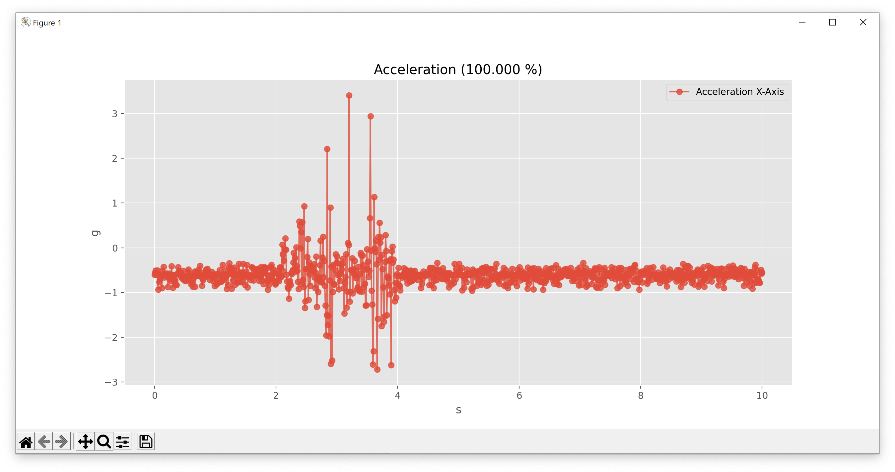

# ICOc

The ICOc software is a collection of tools and scripts for the [ICOtronic system](https://www.mytoolit.com/ICOtronic/). Currently the main purpose of the software is

- data collection (via [`mwt.py`](mwt.py) or the [ICOc script](Scripts/ReadMe.md))
- and testing the functionality of the Sensory Holder Assembly (SHA) and Sensory Tool Holder (STH).

For these purposes the software reads data from the Stationary Transceiver Unit (STU) via CAN using the MyTooliT protocol. The STU itself reads from and writes data to the SHA/STH via Bluetooth.

The framework currently requires

- [Microsoft Windows 10](https://microsoft.com/windows), and
- [Python 3.6](https://www.python.org) or newer.

For more information about other required software components, please read the subsection “Software” in this document.

## Requirements

### Hardware

In order to setup a test bench you need at least:

- a [PCAN adapter](https://www.peak-system.com),
- a [Sensory Holder Assembly or Sensory Tool Holder](https://www.mytoolit.com/ICOtronic/),
- a [Stationary Transceiver Unit](https://www.mytoolit.com/ICOtronic/).

### Software

#### Python

##### Interpreter

MyToolIt Watch requires at least Python `3.6`. Later versions should work too. You can download Python [here](https://www.python.org/downloads).

When you install the package downloaded above, please do not forget to enable the checkbox “Add Python to PATH” in the setup window of the installer.

If you want to also install additional tools, such as the IDE [Spyder](https://www.spyder-ide.org), we recommend you use [Anaconda](https://www.anaconda.com) – instead of the official Python installer – to install Python on your machine.

##### Packages

Since MyToolIt Watch requires additional Python packages you need to install them too. You can do that using the following command inside PowerShell or the old Windows command line interface `cmd.exe` in the _root of this repository_:

```sh
pip install -r requirements.txt
```

The command above will read the file [requirement.txt](requirement.txt) and install all the packages listed in this file.

If you want to manually install the required Python libraries you can use the following command instead:

```sh
pip install dynaconf matplotlib openpyxl pdfrw python-can reportlab windows-curses
```

#### ICOc

Please clone this repository (`git@github.com:MyTooliT/ICOc.git`) to a directory of your choice. You can either use the [command line tool `git`](https://git-scm.com/downloads):

```
git clone git@github.com:MyTooliT/ICOc.git
```

or one of the many available [graphical user interfaces for Git](https://git-scm.com/downloads/guis) to do that.

The repository contains everything necessary to connect to an STU via CAN and pull data from the attached STHs.

#### Simplicity Studio

For the tests that require a firmware flash, such as the [production tests](mytoolit/test/production) you need to [install Simplicity Studio](https://www.silabs.com/products/development-tools/software/simplicity-studio). Please also make sure to install the Simplicity Commander tool inside Simplicity Studio.

## Usage

We recommend that you add the [scripts directory](Scripts) to your path environment variable. Afterwards you can use all [the scripts in this folder](Scripts/ReadMe.md) directly in your Terminal application of choice, without the need to change the current working directory.

### Control and Data Acquirement

#### Start the Program

The `ICOc` script can be used to control an STH (or SHA). After you enter the command

```sh
ICOc
```

in your terminal, a text based interface shows you the currently available options. For example, the text

```
MyToolIt Terminal

1: 08:6b:d7:01:de:81(Blubb)@-52dBm

q: Quit program
1-9: Connect to STH number (ENTER at input end)
E: EEPROM (Permanent Storage)
l: Log File Name
n: Change Device Name
t: Test Menu
u: Update Menu
x: Xml Data Base
```

shows that currently one STH was detected. The Bluetooth MAC address of the STH is `08:6b:d7:01:de:81`, while its advertisement name is “Blubb”. The last value after the `@` character shows the current received signal strength indication (RSSI). You can exit the program using the interface using the key <kbd>q</kbd>.

#### Read Acceleration Data

To read data from an STH (or SHA), start the ICOc script, and connect to an STH. To do that, enter the number of the detected STH and use the return key <kbd>⮐</kbd> to confirm your selection. The text based interface will now show you something like this:

```
08:6b:d7:01:de:81(Tanja)
Global Trade Identification Number (GTIN): 0
Hardware Revision(Major.Minor.Build): 1.3.5
Firmware Version(Major.Minor.Build): 2.1.10
Firmware Release Name: Tanja
Serial: -

Battery Voltage: 3.05V
Internal Chip Temperature: 29.6°C

Run Time: 0s
Interval Time: 0s
Adc Prescaler/AcquisitionTime/OversamplingRate/Reference(Samples/s): 2/8/64/VDD(9524)
Acc Config(XYZ/DataSets): 100/3

a: Config ADC
d: Display Time
e: Exit and disconnect from holder
f: OEM Free Use
n: Set Device Name
O: Off(Standby)
p: Config Acceleration Points(XYZ)
r: Config run time and interval time
s: Start Data Acquisition
```

To start the data acquisition press the key <kbd>s</kbd>. Afterwards a graphical window



will show the measured acceleration. To stop the data acquisition, click the close button on the top of the graph.

## Program Execution

MyToolIt Watch supports a program library, console access and a terminal that access the Watch program library. Thus, MyToolIt Watch may be embedded in another application or used standalone.

### Help

The program also supports help. The help support may be used as follows:

- Open Command Prompt (Eingabeaufforderung)
- Navigate to the MyToolIt Watch directory via cd directoryName
- Type python mwt.py -h

#### Services

MyToolIt Watch derives it functionality to MyToolIt Watch Terminal(mwt.py) and MyToolIt Watch Terminal includes an additional terminal service. Furthermore, MyToolItWatch Terminal supports the following services:

- STH access for measuring data, configure measuring, request production data, measuring accumulator voltage, setting the Device Name of the STH (Bluetooth advertisement name), putting the STH into Standby(Only the charging cradle resets the Standby State)
- Access the EEPROM via Excel for setting the EEPROM or receiving stored data such as the operating seconds since first power on.
- Set the logname (The MyToolIt Service will ask you for this log file).
- Change the STH device Name directly
- Test Menu that actually supports internal verification of the STH and STU (keyword Sth or Stu determines this) and the internal verification is also spitted into automated and manual tests.
- Configuration of the configKeys.xml XML File
  - Create new versions of STH and STU(Describes the EEPROM content via Excel)
  - Create new setups that describes measure configurations via console start
  - Remove versions
  - Remove setups
  - Set Excel names

Note that CTRL+C (Strg+C) always quit the program or an input request.

### Program library

The MyToolIt Watch library may be used to integrate MyToolIt Watch into non MyToolIt Application e.g. write your own python scripts to fulfill tasks. The library is described via comments and used via MyToolIt Watch Terminal.

### Console Application

MyToolIt Watch for acquiring data may be started directly via the command prompt. To call it directly you have to open a command prompt (Eingabeauffordernung), navigate to the MyToolIt Watch directory and execute MyToolIt Watch or MyToolIt Watch Terminal.

The correct use of this command will yield into an automatic start of the data acquisition.

#### Additional Arguments

Open a command prompt (console) and navigate to the software project folder(location of mytoolitwatch.py). To execute the program call mwt.py with the corresponding arguments to configure ADC settings.

```
python mwt.py -x configKeys.xml additionalArguments
```

| argument                                      | meaning/Example                                                                                                                                                                          |
| --------------------------------------------- | ---------------------------------------------------------------------------------------------------------------------------------------------------------------------------------------- |
| -h                                            | Show help menu                                                                                                                                                                           |
| -x configKeys.xml                             | Specifies XML File. Note that you may create another xml file and use this.                                                                                                              |
| -a prescaler acquisitionTime overSamplingRate | Configure ADC prescaler(2-127), Acquisition Time(1,2,3,4,8,16, ... 256) and oversampling Rate(1,2,4,8, 16, .... 4096)                                                                    |
| -b Address                                    | Connects to device with specified address                                                                                                                                                |
| -e name.xlsx                                  | Chose Excel File to for accessing EERPOM(Read and Write)                                                                                                                                 |
| -i time                                       | Interval Time for creating a fresh log file in seconds. Values below 10 will deactivate this feature                                                                                     |
| -l logName                                    | Specifies logname where data and information will be dumped                                                                                                                              |
| -n name                                       | Connect to device name(bluetooth name). Note that this will be overruled by the -b parameter.                                                                                            |
| -p xyz                                        | Acceleration Sampling Points in the format xyz e.g. 100 will collect Data for x-Acceleration axis or 111 will collect x, y and z-Acceleration axis.                                      |
| -r time                                       | Run Time in seconds or 0 for infinite                                                                                                                                                    |
| -s samplesetup                                | Use sample setup to avoid passing additional parameters for program start e.g. -s X                                                                                                      |
| -v device version                             | Chose device and version for access e.g. STH v2.1.3                                                                                                                                      |
| -- gui_dim seconds                            | Time axis length in seconds. Note that 0 deactivates this feature.                                                                                                                       |
| --refv ref                                    | Specifies ADC reference voltage. Notat that VDD(3V3) supports the full ADC range:<br /><1V25<br/>Vfs1V65<br/>Vfs1V8<br/>Vfs2V1<br/>Vfs2V2<br/>2V5<br/>Vfs2V7<br/>VDD<br/>5V<br/>6V6br /> |
| --save                                        | Saves setup in the configuration. Note that this will store additional setup settings.<br />                                                                                             |
| --show_config                                 | Shows current configuration after loading xml data base and passing additional arguments.<br />                                                                                          |
| --voltage_points xyz                          | Turn on battery voltage streaming(100) or turns off battery voltage streaming(000)                                                                                                       |

##### Prescaler AcquisitionTime and OversamplingRate

The sampling rate is achieved via the following formula:

$$
f_{sampling} = \frac{38,4MHz}{(Prescaler+1)\cdot(AcquisitionTime +13)\cdot OversamplingRate}
$$

We should mention that continuous measurements will be sent in data triples and a CAN 2.0 message contains in a such case a data triple. Moreover, other formats (e.g. AccX, AccY and AccZ as a vector) are a data points and a CAN 20 message contains such a data point. Note, that the performance of the computer system is limited and an overload causes lost messages. Please check the data log for the Error Status Word of the Stationary Transceiver Holder (STU).

The prescaler determines the Analog Digital Converter (ADC) Clock. Moreover, the acquisition time determines the hold time before sampling such that the actual voltage charges a capacitor. The capacitor charge determines the corresponding physical value and this capacitor is disconnected from the input circuit during the conversion. Furthermore, the oversampling rate determines the number of samples for averaging. Note that the ADC of the system is a 12-Bit ADC and with 256 over samples the maximum accuracy of 16-Bit may be achieved.

As the lowest usable prescaler setting is 2, this table lists compares the resulting ADC overall sampling frequency (not per Acc channel) as function of oversampling and acquisition time. The resulting sampling rate must not exceed 9.5kS/s.

|   f_sample   |     |          |          |          |          |          |          |          |          |
| :----------: | --- | -------- | -------- | -------- | -------- | -------- | -------- | -------- | -------- |
|              |     | AcqTime  |          |          |          |          |          |          |          |
| Oversampling |     | 1        | 2        | 3        | 4        | 8        | 16       | 32       | 64       |
|      1       |     | 2.74E+06 | 2.56E+06 | 2.40E+06 | 2.26E+06 | 1.83E+06 | 1.32E+06 | 8.53E+05 | 4.99E+05 |
|      2       |     | 1.37E+06 | 1.28E+06 | 1.20E+06 | 1.13E+06 | 9.14E+05 | 6.62E+05 | 4.27E+05 | 2.49E+05 |
|      4       |     | 6.86E+05 | 6.40E+05 | 6.00E+05 | 5.65E+05 | 4.57E+05 | 3.31E+05 | 2.13E+05 | 1.25E+05 |
|      8       |     | 3.43E+05 | 3.20E+05 | 3.00E+05 | 2.82E+05 | 2.29E+05 | 1.66E+05 | 1.07E+05 | 6.23E+04 |
|      16      |     | 1.71E+05 | 1.60E+05 | 1.50E+05 | 1.41E+05 | 1.14E+05 | 8.28E+04 | 5.33E+04 | 3.12E+04 |
|      32      |     | 8.57E+04 | 8.00E+04 | 7.50E+04 | 7.06E+04 | 5.71E+04 | 4.14E+04 | 2.67E+04 | 1.56E+04 |
|      64      |     | 4.29E+04 | 4.00E+04 | 3.75E+04 | 3.53E+04 | 2.86E+04 | 2.07E+04 | 1.33E+04 | 7.79E+03 |
|     128      |     | 2.14E+04 | 2.00E+04 | 1.88E+04 | 1.76E+04 | 1.43E+04 | 1.03E+04 | 6.67E+03 | 3.90E+03 |
|     256      |     | 1.07E+04 | 1.00E+04 | 9.38E+03 | 8.82E+03 | 7.14E+03 | 5.17E+03 | 3.33E+03 | 1.95E+03 |
|     512      |     | 5.36E+03 | 5.00E+03 | 4.69E+03 | 4.41E+03 | 3.57E+03 | 2.59E+03 | 1.67E+03 | 9.74E+02 |
|     1024     |     | 2.68E+03 | 2.50E+03 | 2.34E+03 | 2.21E+03 | 1.79E+03 | 1.29E+03 | 8.33E+02 | 4.87E+02 |
|     2048     |     | 1.34E+03 | 1.25E+03 | 1.17E+03 | 1.10E+03 | 8.93E+02 | 6.47E+02 | 4.17E+02 | 2.44E+02 |
|     4096     |     | 6.70E+02 | 6.25E+02 | 5.86E+02 | 5.51E+02 | 4.46E+02 | 3.23E+02 | 2.08E+02 | 1.22E+02 |

## Logging

Each log entry is time stamped and tagged. Tags are separated into Information [I], Warnings [W] and Errors [E]. Furthermore, the time stamp is put into the log at logging time and this time stamp has an accuracy of 500ms or better (The operating system and the python interpreter are not real time capable). Not that the common accuracy is usually about 5ms or better.

### Measuring Entry

Each data points gets logged into the log file. Note that AccX stands for acceleration point X, AccY stands for the acceleration point y and AccZ stands for the acceleration point z.

#### Single Measurements

Three measuring points are stored into a single CAN 2.0 message. A CAN message contains a message counter that cyclically increments from 0-255. Thus each message generates three entries in the log with the same message counter (MsgCounter). Moreover, at a reception of a CAN message generates a time stamp (Time Stamp) . Time Stamps in reference to the message counters may be used to determine the correct sampling frequency, message losses and to determine the message jitter (Maximum-Minimums Time determines a jitter). Furthermore, the message value represents the ADC value from the conversion from a sensor voltage to a sensor value. The sensory value transforms to the calibrated International System of Unit (SI) by processing kx+d and the corresponding k and d may be taken from the EEPROM by the configuration commands 0x60(Calibration Factor k) and 0x61(Calibration Factor d). Please see the following example:

[I](2937092ms): MsgCounter: 8; TimeStamp: 236265914.467ms; AccX 32658;
[I](2937092ms): MsgCounter: 8; TimeStamp: 236265914.467ms; AccX 32668;
[I](2937092ms): MsgCounter: 8; TimeStamp: 236265914.467ms; AccX 32671;
[I](2937092ms): MsgCounter: 9; TimeStamp: 236265914.665ms; AccX 32564;
[I](2937092ms): MsgCounter: 9; TimeStamp: 236265914.665ms; AccX 32591;
[I](2937092ms): MsgCounter: 9; TimeStamp: 236265914.665ms; AccX 32693;
[I](2937092ms): MsgCounter: 10; TimeStamp: 236265914.857ms; AccX 32698;
[I](2937092ms): MsgCounter: 10; TimeStamp: 236265914.857ms; AccX 32670;
[I](2937092ms): MsgCounter: 10; TimeStamp: 236265914.857ms; AccX 32578;

In this example 3 CAN messages are received and these messages contain 9 data points (x-dimension in that case). Each CAN message keeps a message counter value(8,9, 10) and the message jitter is 198µs-192µs -> 6µs for that interval.

#### Double and Triple Measurements

A single vector fits into a single CAN 2.0 message. A CAN message contains a message counter that cyclically increments from 0-255. Thus each vector generates a single entry that contains a message counter value(MsgCounter). Moreover, each received CAN message gets time stamped (Time Stamp). Time Stamps in reference to the message counters may be used to determine the correct sampling frequency, message losses and to determine the message jitter (Maximum-Minimums Time determines a jitter). Furthermore, the message value represents the ADC value from the conversion from a sensor voltage to a sensor value. Each sensory value transforms to the calibrated International System of Unit (SI) by processing kx+d and the corresponding k and d may be taken from the EEPROM by the configuration commands 0x60(Calibration Factor k) and 0x61(Calibration Factor d). Please see the following example:

[I](1076702ms): MsgCounter: 197; TimeStamp: 238783540.943ms; AccX 32682; AccY 10904; AccZ 10957;
[I](1076703ms): MsgCounter: 198; TimeStamp: 238783541.115ms; AccX 32654; AccY 10984; AccZ 10972;
[I](1076703ms): MsgCounter: 199; TimeStamp: 238783541.285ms; AccX 32683; AccY 11006; AccZ 10902;

In this example 3 CAN messages are received and these messages contains 3 vectors(x,y, z-dimension in that case). Each CAN message keeps a message counter value(197,198, 199) and the message jitter is 172µs-170µs -> 2µs for that interval.

### Bluetooth Send Counter

Number of send Bluetooth Frames. Note that multiple MyToolIt messages are put into a single Bluetooth frame.

### Bluetooth Receive Counter

Number of received Bluetooth Frames. Note that multiple MyToolIt messages are put into a single Bluetooth frame.

### Bluetooth RSSI

The Receive Signal Strength Indicator determines (approximately) the received signal power. Note that a RSSI over -70dBm determines a good signal quality and below -90dBm determines a poor signal quality. Please mention that this value is taken at the end of the log once (but may be supported during measuring).

### Send Counter

Number of sent messages to a port e.g. STH to STU

### Send Fail Counter

Number of trashed messages at a port. A send message may get trashed in overload cases.

### Send Byte Counter

Number of send bytes at a port. This number correlates to the Send Counter and is determined approximately.

### Receive Counter

Number of received messages from a port e.g. STU to STH

### Receive Fail Counter

Number of dropped messages. This must not happen at all and determines and overloaded computer system.

### Receive Byte Counter

Number of received bytes at a port. This number correlates to the Send Counter and is determined approximately.

### Status Word

The log show the status word of the STU. Please do not take any information out of this log entry.

### Error Word

Error Status Word of the STU and this <u>**Error Status Word must be 0.**</u>

## Production Tests

## STH

To run the production tests for the STH, please execute the following command in the root of the repository:

```sh
python mytoolit/test/production/sth.py
```

If you change the current working directory to the test directory:

```sh
cd mytoolit/test/production
```

then you can invoke the command directly via

```sh
python sth.py
```

Depending on your environment, using `py` instead of `python` might also work:

```sh
py sth.py
```

For a list of available command line options, please use the option `-h`:

```sh
python sth.py -h
```

### Specific Tests

To only run a single test you need the specify its name. For example, to run the test `test__firmware_flash` you can use the following command:

```sh
python sth.py TestSTH.test__firmware_flash
```

You can also run specific tests using pattern matching. To do that use the command line option `-k`. For example to run the firmware flash and the connection test you can use the command:

```sh
python sth.py -k flash -k connection
```

, which executes all tests that contain the text `flash` or `connection`.

### Wrapper Script

We provide a very simple wrapper script for the STH test called [`Test-STH.ps1`](../Scripts/Test-STH.ps1). This script just executes the script `sth.py` with the current Python interpreter forwarding the given command line arguments in the process. If you add the [Scripts](../Scripts) folder to your Windows path variable, you can call the wrapper script (and hence the STH test) regardless of the current path. For example, to execute the EEPROM test just call

```sh
Test-STH -k eeprom
```

inside the Terminal. If this command shows an execution policy error, then please read the section “How Can I Fix Execution Policy Errors?” in the [FAQ](Documentation/FAQ.md).
