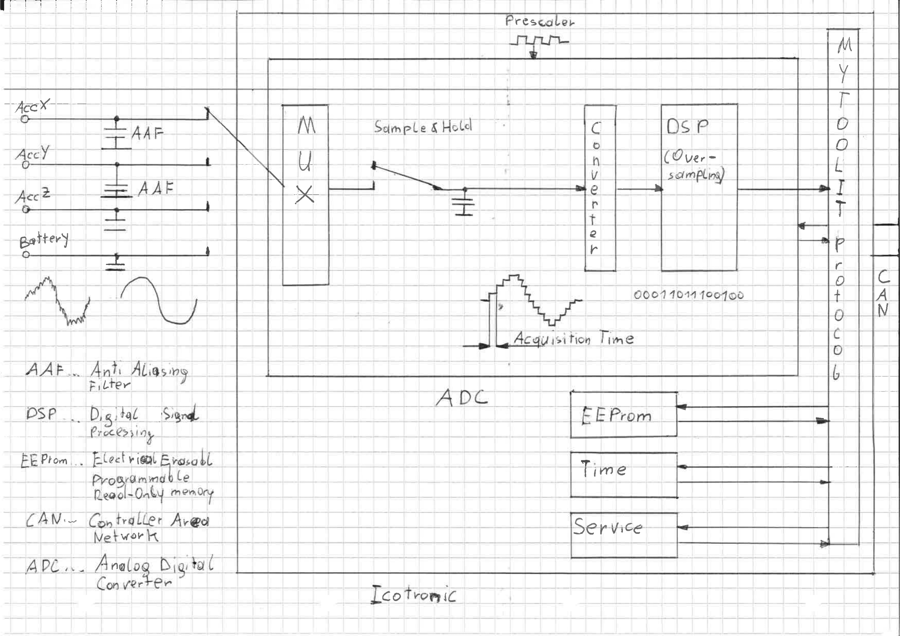

[TOC]

# MyToolIt Watch

The MyToolIt Watch system supports Sensory Tool Holder Data and additional services like serial numbers or statistics to the users:

- MyToolIt Protocol: Protocol to communicate via Bluetooth and CAN. Prepared for CAN-FD too.
  Extendable for other Logical Link Layer protocols
- MyToolIt PeakCanFd driver: Driver to interact via Peak CAN with CAN 2.0. Prepared for CAN-FD.
- MyToolIt Production Tests: Production tests for quality management.
- MyToolIt Verification: Verifications for Firmware and Hardware.
- MyToolItWatch: Supports high level MyToolIt functionality. May be integrated in alien frame works and/or software
- MyToolItTerminal: Terminal program that supports MyToolItWatch functionality

This framework runs under Microsoft Windows 10 and supports its features via console (Microsoft Command Promt) and Liclipse. Liclipse (Version 5.1.3.201811082122)
is an integrated development environment (IDE) and may be used to access the MyToolIt Test functionalities. Furthermore, Python 3.5 and
additional Python Modules are required to support the framework.

## System diagram

The following figure describes the overall system.



The Icotronic System consists of the Stationary Transceiver Unit(STU), the Sensory Tool Holder(STH) and a subscriber that uses STH and STU via the MyToolIt Protocol. The MyToolIt Protocol is a network protocol that exchanges information between subscribers and therefor MyToolIt access Controller Area Network and Bluetooth to transport information. This Information transport is used to provide services to the user. A user service may be collecting data, request serial numbers, operating time, etc. Note that the MyToolIt Protocol is expendable for other underlaying data link layer protocols such as e.g. Wireless LAN. Thus the STU is accessible by CAN 2.0, Bluetooth and other data link layer protocols.

Furthermore, the main system services may be divided as follows:

- Data Collection

  - Acceleration Sensor Data
  - Voltage Measurement
  - Temperature measurement of the electronics
  - User specific signals

- Storage Requests

  - Statistical Data
  - Production Data e.g. Serial Numbers
  - Parameters e.g. Bluetooth advertisement time
  - Calibration Factors (kx+d)

- Configuration
  - Analog Digital Converter (ADC) - The ADC converts e.g. voltages from sensors to sensory signals
  - Communication Parameters e.g. Bluetooth Advertisement Name
  - EEPROM Lock Status
  - Human Machine Interface (HMI)
- Remaining Services

  - Time
  - Standby
  - Meta communication information e.g. number of sent Bytes for a communication port like CAN

- Test Functionality
  - Test Signals
  - Production Tests
  - Hardware Test
  - Internal Verification

## Data Acquisition

The data acquisition subsystem consists of input pins to measure sensory data like acceleration (physical values corresponds to voltages) and these input pins may be multiplexed to achieve a vector e.g. acceleration in x, y and z dimension. Furthermore, input values are filtered via an Anti-Aliasing Filter (AAF). This AAF is not configurable and required due to the Nyquist–Shannon sampling theorem. Moreover, the sample and hold (S&H) part converts a time continuous signal into a time discrete signal such that the converter proper translate a continues value into a discrete value. This time discrete and value discrete value may be processed in a digital processing system to e.g. do averaging. Note that the part from AAF to DSP is the Analog to Digital Converter Part that must be clocked by a clock frequency and a prescaler. Furthermore, the MyToolIt protocol transports the digital value to the personal computer and this data is stored in a log file. Note that Controller Area Network (CAN) is the interface between the Personal Computer and the Sensory System and the Personal Computer connects to CAN via the PEAK CAN-USB adapter.

# Getting started

In order to setup a test-bench you need:

- CAN-Adapter
  - Peak-Tech (Including driver)
- STU
- STH
- Python (See Software)
- Additional python packages (See Software)

## Peak-Tech

### Download the driver

Download the driver installer for your operating system (https://www.peak-system.com/PCAN-USB-FD.365.0.html) and include the PCAN-Basic option in your install to get the Python interface.

### Install the Peak-Basic API

does not work, download PCAN-Basic API separately. This provides a zip folder that needs to be in:

```
C:\Program Files\PEAK-System\PCAN-Basic API\
```

So that acqAcc.py can locate the driver.

### Check/Configure your hardware

Check if you Peak adapter's hardware is configured correctly

JP4 needs to be connected in order to activate the +5V supply. Be aware that the adapter can only supply 10mA of current. This is far too little for this application. However, it can be used as active signal.


JP1 and JP2 need to be connected to terminate the CAN Bus inside the adapter. This is highly recommended as the cable is not terminated externally in most cases.


### Connectors

The pinout of Peak-CAN


Adapter cable's pinout

| X301 pin | signal      | wire color | XLR pin | sub-D pin |
| :------- | ----------- | ---------- | ------- | --------- |
| 1        | +5V         | red        |         |           |
| 2        | EXT\_!Reset | orange     |         | NC        |
| 3        | CAN_H       | yellow     |         | 7         |
| 4        | CAN_L       | green      |         | 2         |
| 5        | NC          | brown      |         | NC        |
| 6        | GND         | black      |         | 3         |

# test/flash the firmware

how can we test the firmware installed on a STH or STU?

how can we test for bootloader

set the debug to out

clone the repo

flash the firmware

compile the firmware

# Software

This chapter describes how to setup/execute the required software for acquiring data.

## Python

### Interpreter

MyToolIt Watch requires at least Python `3.5.4`. Later versions should work too. You can download Python [here](https://www.python.org/downloads).

When you install the package downloaded above, please do not forget to enable the checkbox “Add Python to PATH” in the setup window of the installer.

If you want to also install additional tools, such as the IDE [Spyder](https://www.spyder-ide.org), we recommend you use [Anaconda](https://www.anaconda.com) – instead of the official Python installer – to install Python on your machine.

### Packages

Since MyToolIt Watch requires additional Python packages you need to install them too. You can do that using the following command inside PowerShell or the old Windows command line interface `cmd.exe`:

```sh
pip install matplotlib mysql-connector openpyxl windows-curses
```

For more information regarding the package installation, please take a look at [`anaconda-shell.bat`](anaconda-shell.bat) and [`installModules.py`](installModules.py).

## MyToolIt Watch

Please clone this repository (`git@bitbucket.org:mytoolit/mytoolitwatch.git`) to a folder of your choice. You can either use the [command line tool `git`](https://git-scm.com/downloads):

```
git clone git@bitbucket.org:mytoolit/mytoolitwatch.git
```

or one of the many available [graphical user interfaces for Git](https://git-scm.com/downloads/guis) to do that.

The repository contains everything necessary to connect to an STU via CAN and pull data from the attached STHs.

## Program Execution

MyToolIt Watch supports a program library, console access and a terminal that access the Watch program library. Thus, MyToolIt Watch may be embedded in another application or used standalone.

### Help

The program also supports help. The help support may be used as follows:

- Open Command Prompt (Eingabeaufforderung)
- Navigate to the MyToolIt Watch directory via cd directoryName
- Type python mwt.py -h

#### Services

MyToolIt Watch derives it functionality to MyToolIt Watch Terminal(mwt.py) and MyToolIt Watch Terminal includes an additional terminal service. Furthermore, MyToolItWatch Terminal supports the following services:

- STH access for measuring data, configure measuring, request production data, measuring accumulator voltage, setting the Device Name of the STH (Bluetooth advertisement name), putting the STH into Standby(Only the charging cradle resets the Standby State)
- Access the EEPROM via Excel for setting the EEPROM or receiving stored data such as the operating seconds since first power on.
- Set the logname (The MyToolIt Service will ask you for this log file).
- Change the STH device Name directly
- Test Menu that actually supports internal verification of the STH and STU (keyword Sth or Stu determines this) and the internal verification is also spitted into automated and manual tests.
- Configuration of the configKeys.xml XML File
  - Create new versions of STH and STU(Describes the EEPROM content via Excel)
  - Create new setups that describes measure configurations via console start
  - Remove versions
  - Remove setups
  - Set Excel names

Note that CTRL+C (Strg+C) always quit the program or an input request.

### Program library

The MyToolIt Watch library may be used to integrate MyToolIt Watch into non MyToolIt Application e.g. write your own python scripts to fulfill tasks. The library is described via comments and used via MyToolIt Watch Terminal.

### Console Application

MyToolIt Watch for acquiring data may be started directly via the command prompt. To call it directly you have to open a command prompt (Eingabeauffordernung), navigate to the MyToolIt Watch directory and execute MyToolIt Watch or MyToolIt Watch Terminal.

The correct use of this command will yield into an automatic start of the data acquisition.

#### Additional Arguments

Open a command prompt (console) and navigate to the software project folder(location of mytoolitwatch.py). To execute the program call mwt.py with the corresponding arguments to configure ADC settings.

```
python mwt.py -x configKeys.xml additionalArguments
```

| argument                                      | meaning/Example                                                                                                                                                                          |
| --------------------------------------------- | ---------------------------------------------------------------------------------------------------------------------------------------------------------------------------------------- |
| -h                                            | Show help menu                                                                                                                                                                           |
| -x configKeys.xml                             | Specifies XML File. Note that you may create another xml file and use this.                                                                                                              |
| -a prescaler acquisitionTime overSamplingRate | Configure ADC prescaler(2-127), Acquisition Time(1,2,3,4,8,16, ... 256) and oversampling Rate(1,2,4,8, 16, .... 4096)                                                                    |
| -b Address                                    | Connects to device with specified address                                                                                                                                                |
| -e name.xlsx                                  | Chose Excel File to for accessing EERPOM(Read and Write)                                                                                                                                 |
| -i time                                       | Interval Time for creating a fresh log file in seconds. Values below 10 will deactivate this feature                                                                                     |
| -l logName                                    | Specifies logname where data and information will be dumped                                                                                                                              |
| -n name                                       | Connect to device name(bluetooth name). Note that this will be overruled by the -b parameter.                                                                                            |
| -p xyz                                        | Acceleration Sampling Points in the format xyz e.g. 100 will collect Data for x-Acceleration axis or 111 will collect x, y and z-Acceleration axis.                                      |
| -r time                                       | Run Time in seconds or 0 for infinite                                                                                                                                                    |
| -s samplesetup                                | Use sample setup to avoid passing additional parameters for program start e.g. -s X                                                                                                      |
| -v device version                             | Chose device and version for access e.g. STH v2.1.3                                                                                                                                      |
| -- gui_dim seconds                            | Time axis length in seconds. Note that 0 deactivates this feature.                                                                                                                       |
| --refv ref                                    | Specifies ADC reference voltage. Notat that VDD(3V3) supports the full ADC range:<br /><1V25<br/>Vfs1V65<br/>Vfs1V8<br/>Vfs2V1<br/>Vfs2V2<br/>2V5<br/>Vfs2V7<br/>VDD<br/>5V<br/>6V6br /> |
| --save                                        | Saves setup in the configuration. Note that this will store additional setup settings.<br />                                                                                             |
| --show_config                                 | Shows current configuration after loading xml data base and passing additional arguments.<br />                                                                                          |
| --voltage_points xyz                          | Turn on battery voltage streaming(100) or turns off battery voltage streaming(000)                                                                                                       |

##### Prescaler AcquisitionTime and OversamplingRate

The sampling rate is achieved via the following formula:

$$
f_{sampling} = \frac{38,4MHz}{(Prescaler+1)\cdot(AcquisitionTime +13)\cdot OversamplingRate}
$$

We should mention that continuous measurements will be sent in data triples and a CAN 2.0 message contains in a such case a data triple. Moreover, other formats (e.g. AccX, AccY and AccZ as a vector) are a data points and a CAN 20 message contains such a data point. Note, that the performance of the computer system is limited and an overload causes lost messages. Please check the data log for the Error Status Word of the Stationary Transceiver Holder (STU).

The prescaler determines the Analog Digital Converter (ADC) Clock. Moreover, the acquisition time determines the hold time before sampling such that the actual voltage charges a capacitor. The capacitor charge determines the corresponding physical value and this capacitor is disconnected from the input circuit during the conversion. Furthermore, the oversampling rate determines the number of samples for averaging. Note that the ADC of the system is a 12-Bit ADC and with 256 over samples the maximum accuracy of 16-Bit may be achieved.

As the lowest usable prescaler setting is 2, this table lists compares the resulting ADC overall sampling frequency (not per Acc channel) as function of oversampling and acquisition time. The resulting sampling rate must not exceed 9.5kS/s.

|   f_sample   |     |          |          |          |          |          |          |          |          |
| :----------: | --- | -------- | -------- | -------- | -------- | -------- | -------- | -------- | -------- |
|              |     | AcqTime  |          |          |          |          |          |          |          |
| Oversampling |     | 1        | 2        | 3        | 4        | 8        | 16       | 32       | 64       |
|      1       |     | 2.74E+06 | 2.56E+06 | 2.40E+06 | 2.26E+06 | 1.83E+06 | 1.32E+06 | 8.53E+05 | 4.99E+05 |
|      2       |     | 1.37E+06 | 1.28E+06 | 1.20E+06 | 1.13E+06 | 9.14E+05 | 6.62E+05 | 4.27E+05 | 2.49E+05 |
|      4       |     | 6.86E+05 | 6.40E+05 | 6.00E+05 | 5.65E+05 | 4.57E+05 | 3.31E+05 | 2.13E+05 | 1.25E+05 |
|      8       |     | 3.43E+05 | 3.20E+05 | 3.00E+05 | 2.82E+05 | 2.29E+05 | 1.66E+05 | 1.07E+05 | 6.23E+04 |
|      16      |     | 1.71E+05 | 1.60E+05 | 1.50E+05 | 1.41E+05 | 1.14E+05 | 8.28E+04 | 5.33E+04 | 3.12E+04 |
|      32      |     | 8.57E+04 | 8.00E+04 | 7.50E+04 | 7.06E+04 | 5.71E+04 | 4.14E+04 | 2.67E+04 | 1.56E+04 |
|      64      |     | 4.29E+04 | 4.00E+04 | 3.75E+04 | 3.53E+04 | 2.86E+04 | 2.07E+04 | 1.33E+04 | 7.79E+03 |
|     128      |     | 2.14E+04 | 2.00E+04 | 1.88E+04 | 1.76E+04 | 1.43E+04 | 1.03E+04 | 6.67E+03 | 3.90E+03 |
|     256      |     | 1.07E+04 | 1.00E+04 | 9.38E+03 | 8.82E+03 | 7.14E+03 | 5.17E+03 | 3.33E+03 | 1.95E+03 |
|     512      |     | 5.36E+03 | 5.00E+03 | 4.69E+03 | 4.41E+03 | 3.57E+03 | 2.59E+03 | 1.67E+03 | 9.74E+02 |
|     1024     |     | 2.68E+03 | 2.50E+03 | 2.34E+03 | 2.21E+03 | 1.79E+03 | 1.29E+03 | 8.33E+02 | 4.87E+02 |
|     2048     |     | 1.34E+03 | 1.25E+03 | 1.17E+03 | 1.10E+03 | 8.93E+02 | 6.47E+02 | 4.17E+02 | 2.44E+02 |
|     4096     |     | 6.70E+02 | 6.25E+02 | 5.86E+02 | 5.51E+02 | 4.46E+02 | 3.23E+02 | 2.08E+02 | 1.22E+02 |

## Logging

Each log entry is time stamped and tagged. Tags are separated into Information [I], Warnings [W] and Errors [E]. Furthermore, the time stamp is put into the log at logging time and this time stamp has an accuracy of 500ms or better (The operating system and the python interpreter are not real time capable). Not that the common accuracy is usually about 5ms or better.

### Measuring Entry

Each data points gets logged into the log file. Note that AccX stands for acceleration point X, AccY stands for the acceleration point y and AccZ stands for the acceleration point z.

#### Single Measurements

Three measuring points are stored into a single CAN 2.0 message. A CAN message contains a message counter that cyclically increments from 0-255. Thus each message generates three entries in the log with the same message counter (MsgCounter). Moreover, at a reception of a CAN message generates a time stamp (Time Stamp) . Time Stamps in reference to the message counters may be used to determine the correct sampling frequency, message losses and to determine the message jitter (Maximum-Minimums Time determines a jitter). Furthermore, the message value represents the ADC value from the conversion from a sensor voltage to a sensor value. The sensory value transforms to the calibrated International System of Unit (SI) by processing kx+d and the corresponding k and d may be taken from the EEPROM by the configuration commands 0x60(Calibration Factor k) and 0x61(Calibration Factor d). Please see the following example:

[I](2937092ms): MsgCounter: 8; TimeStamp: 236265914.467ms; AccX 32658;
[I](2937092ms): MsgCounter: 8; TimeStamp: 236265914.467ms; AccX 32668;
[I](2937092ms): MsgCounter: 8; TimeStamp: 236265914.467ms; AccX 32671;
[I](2937092ms): MsgCounter: 9; TimeStamp: 236265914.665ms; AccX 32564;
[I](2937092ms): MsgCounter: 9; TimeStamp: 236265914.665ms; AccX 32591;
[I](2937092ms): MsgCounter: 9; TimeStamp: 236265914.665ms; AccX 32693;
[I](2937092ms): MsgCounter: 10; TimeStamp: 236265914.857ms; AccX 32698;
[I](2937092ms): MsgCounter: 10; TimeStamp: 236265914.857ms; AccX 32670;
[I](2937092ms): MsgCounter: 10; TimeStamp: 236265914.857ms; AccX 32578;

In this example 3 CAN messages are received and these messages contain 9 data points (x-dimension in that case). Each CAN message keeps a message counter value(8,9, 10) and the message jitter is 198µs-192µs -> 6µs for that interval.

#### Double and Triple Measurements

A single vector fits into a single CAN 2.0 message. A CAN message contains a message counter that cyclically increments from 0-255. Thus each vector generates a single entry that contains a message counter value(MsgCounter). Moreover, each received CAN message gets time stamped (Time Stamp). Time Stamps in reference to the message counters may be used to determine the correct sampling frequency, message losses and to determine the message jitter (Maximum-Minimums Time determines a jitter). Furthermore, the message value represents the ADC value from the conversion from a sensor voltage to a sensor value. Each sensory value transforms to the calibrated International System of Unit (SI) by processing kx+d and the corresponding k and d may be taken from the EEPROM by the configuration commands 0x60(Calibration Factor k) and 0x61(Calibration Factor d). Please see the following example:

[I](1076702ms): MsgCounter: 197; TimeStamp: 238783540.943ms; AccX 32682; AccY 10904; AccZ 10957;
[I](1076703ms): MsgCounter: 198; TimeStamp: 238783541.115ms; AccX 32654; AccY 10984; AccZ 10972;
[I](1076703ms): MsgCounter: 199; TimeStamp: 238783541.285ms; AccX 32683; AccY 11006; AccZ 10902;

In this example 3 CAN messages are received and these messages contains 3 vectors(x,y, z-dimension in that case). Each CAN message keeps a message counter value(197,198, 199) and the message jitter is 172µs-170µs -> 2µs for that interval.

### BlueTooth Send Counter

Number of send Bluetooth Frames. Note that multiple MyToolIt messages are put into a single Bluetooth frame.

### BlueTooth Receive Counter

Number of received Bluetooth Frames. Note that multiple MyToolIt messages are put into a single Bluetooth frame.

### BlueTooth Rssi

The Receive Signal Strength Indicator determines (approximately) the received signal power. Note that a RSSI over -70dBm determines a good signal quality and below -90dBm determines a poor signal quality. Please mention that this value is taken at the end of the log once (but may be supported during measuring).

### Send Counter

Number of sent messages to a port e.g. STH to STU

### Send Fail Counter

Number of trashed messages at a port. A send message may get trashed in overload cases.

### Send Byte Counter

Number of send bytes at a port. This number correlates to the Send Counter and is determined approximately.

### Receive Counter

Number of received messages from a port e.g. STU to STH

### Receive Fail Counter

Number of dropped messages. This must not happen at all and determines and overloaded computer system.

### Receive Byte Counter

Number of received bytes at a port. This number correlates to the Send Counter and is determined approximately.

### Status Word

The log show the status word of the STU. Please do not take any information out of this log entry.

### Error Word

Error Status Word of the STU and this <u>**Error Status Word must be 0.**</u>

# Production Tests

Any production Test may be called multiple times for the same STH/STU (PCB). Furthermore, the test results are stored by the Bluetooth Address and a consecutively run number (file name). Thus a
PCBs, assembled STHs/STUs and a potted STHs may be tested in a row.

The Production Tests are supported via:

- ProductionTests/Sth.py: Tests Sensory Tool Holder (STH) and STH print circuit boards (PCBs).
  - sVersion: "v2.1.10" -> Related STU Firmware Version.
  - sLogName: 'ProductionTestStu' -> Related logFile.txt
  - sBuildLocation = "../../SimplicityStudio/v4_workspace/STU/builds/" -> Location of the firmware builds, manufacturing images and the OTA Files. Please refer to the chapter
    Image Locations.
  - sSilabsCommanderLocation = "../../SimplicityStudio/SimplicityCommander/" -> Location of the Simplicity Command. Please refer to Technical Requirements.
  - sAdapterSerialNo = "440116697" The number of the programming board. Please refer to the chapter technical requirements.
  - sBoardType = "BGM111A256V2" -> Model Name of the assembled µC. Please refer to the chapter Icotronic system.
- ProductionTests/Stu.py: Tests Stationary Transceiver Unit(STU) and STU PCBs.
  Moreover, the parameters may/must be changed inside the script if it runs via Liclipse and this is fulfilled via changing:
  - sVersion = "v2.1.9" -> Related STH Firmware Version.
  - sLogName = 'ProductionTestSth' -> Related logFile.txt
  - sLogLocation = '../../Logs/ProductionTestSth/' -> Where to archive logs and test protocol
  - sOtaComPort = 'COM6' -> COM-Port of the Over-The-Air (OTA) programming board (Assembled with BGM111 module). Please, refer to chapter Over-The-Air (OTA) update.
  - sBuildLocation = "../../SimplicityStudio/v4_workspace/STH/builds/" -> Location of the firmware builds, manufacturing images and the OTA Files. Please refer to the chapter
    Image Locations.
  - sSilabsCommanderLocation = "../../SimplicityStudio/SimplicityCommander/" -> Location of the Simplicity Command. Please refer to Technical Requirements.
  - sAdapterSerialNo = "440115849" The number of the programming board. Please refer to the chapter technical requirements.
  - sBoardType = "BGM113A256V2" -> Model Name of the assembled µC. Please refer to the chapter Icotronic system.
  - iSensorAxis = 1 -> STH only... 3 axis sensor or single axis sensor.
  - bConnectedBattery= True Testing PCB or assembled/potted STH/STU
  - uAdc2Acc: Total range of acceleration sensor in g
  - iRssiMin: Minimum RSSI for STH and STU
  - bStuPcbOnly: STU is not assembled

## How to run

To run this via command prompt dir to the location of the production test scripts. The production test scripts are located in the ProductionTests subfolder in
MyToolItWatch install directory. Furthermore, the scrips may be called via:

- Opening a command prompt
- Navigate to mytoolitwatch/ProductionTests (cd ..\mytoolitwatch\ProductionTests)
- Type "python Sth.py loglocation temporaryLogName VERSION e.g. python Sth.py ../../Logs/ProductionTestSth/ LogsSth.txt v2.1.10 or type python Stu.py LogLocation temporaryLogName VERSION e.g. python Stu.py ../../Logs/ProductionTestStu/ LogsStu.txt v2.1.9
- The console prints any negative result or nothing it the test was OK. Moreover, the logs as well as a test protocol are archived at the
  log location.

Additionally, the production test may be called via Licpse. Liclipse supports complete test runs, single test runs or partially test runs. Test Runs may be called
via opening the corresponding production Test script (Open directory in Liclipse and double click on the file):

- mytoolitwatch\ProductionTests\Stu.py (STU production test), pressing CTRL + F9 (STRG + F9), selecting TestStu or any single test case or selecting partial test case and pressing ENTER.
- mytoolitwatch\ProductionTests\Sth.py (STH production test), pressing CTRL + F9 (STRG + F9), selecting TestSth or any single test case or selecting partial test case and pressing ENTER.
  Furthermore, Liclipse prints any negative result or nothing it the test was OK. Moreover, the logs as well as a test protocol are archived at the
  log location.
